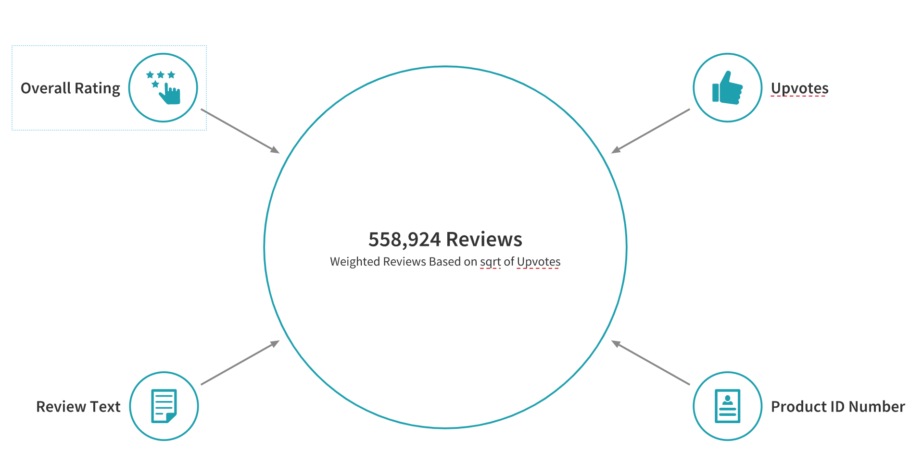

# Semantic Topic Analysis
Semantic Topic Analysis: Amazon Product Reviews (NLP and NMF)

> Project Goals:
- Deploy an NLP model to predict High and Low ratings based on user reviews.
- Use NMF and TSNE to obtain insights into user reviews and present visualizations of data.
---

### Table of Contents
- [Description](#description)
- [Data Understanding](#data-understanding)
- [Data Preparation and NLP Prediction](#data-preparation-and-NLP-prediction)
- [NMF Topic Analysis](#NMF-Topic-Analysis)
- [Author-Info](#author-info)

---
## Description

Amazon's superior supply chain logistics, focus on technology, and online capabilities have allowed it to capture roughly 50% of the ecommerce market with over 1/3 of Americans having an Amazon Prime Membership. With such diverse and charismatic product offerings, competition is fierce among sellers as whoever maintains the best product will be funnelled immense sales through Amazon's search algorhythm. Therefore, maintaining a high rating is of utmost importance and adapting a product to consumer feedback can mean success or failure for a product. However, this consumer feedback can sometimes be lost among the hundreds of millions of reviews on amazon. 

This project seeks to develop an NLP model to classify and predict customer sentiment. More importantly, it seeks to utilize semi-supervised machine learning in the form of NMF and TSNE in order to further interpret text data to obtain product specific insights from reviews. This can be used to gain an edge over competiting products as it would allow real-time monitoring of product reviews and faster product adaptation to positive and negative customer feedback.    

[Back To The Top](#Semantic-Topic-Analysis)

---

## Data Understanding

The data consisted of 574,628 reviews (75MB json.gz) from Amazon's luxury beauty market between 2014 - 2018. I chose the luxury beauty category due to having the highest ratio of reviews to product (45 reviews/product) with the next closest product category being video games (31 reviews/product). Each review consisted of the following data:

1. Overall Rating: 1-5 stars.
2. Number of Upvotes: # of other users who upvoted review.
3. Review Text: Text of the review. 
4. Product ASIN: Specific product ID number. 

There were additional meta-data such as date/time of the review, information of the reviewer, and image/product description (mostly NaNs). For this specific project, this data was not used. After cleaning and removing duplicate reviews roughly 450,000 reviews remained. In order to properly weight the importance of upvotes, the square root of the number of upvotes was used to duplicate the reviews. A logarithmic approach was considered but deemed too harsh for higher upvoted reviews as small scale upvoting and downvoting product attacks are quite common in this intense market environment. After compensating for upvoted reviews, the total number of reviews was 558,924. 

[Back To The Top](#Semantic-Topic-Analysis)

---

## Data Preparation and NLP Prediction

I utilized Google Colab for the running of the models as I had Colab Pro. However, Amazon SageMaker or creating an AWS Jupyter Notebook EC2 Server with a static IP address was also considered.   

The data was split into two categories: Low Rating (1-3 stars) and High Rating (4-5 stars). Splitting into 3 categories, Low Rating (1-2 stars), Average (3 stars), and High Rating (4-5), was considered but greatly dimished the power of the analysis due to limited number of 3 star samples in proportion to the other categories. After the split, the data was grouped into 24.8% (141,091) Low Rating and 74.2% (417,834) High Rating reviews. A quarter of 141,091 reviews were randomly sampled (35,272) and the same number was randomly sampled from the High Rating reviews. This would be used for training and testing the best model and had a balance of 50% Low Rating / 50% High Rating. The model would then be tested on the remaining 21.7% (105,819) Low Rating and 78.3% High Rating (382,563) review samples the model has never seen. 

Logistic Regression, Random Forest, Linear SVC, and Multi-Naive Bayes were train/tested on the sub-sample data and then tested on the remaining data. Linear SVC was the best model with an f1-score of 91% and 73% for predicting High Ratings and Low Ratings respectively. This is quite impressive considering the remaining data had a porportion of 78.3% High Rating and 21.7% Low Rating.

[Back To The Top](#Semantic-Topic-Analysis)

---

## NMF Topic Analysis

The next task was to obtain product specific insights from review text. K-Means, LDA, and NMF were used to find latent topics within the text data. Stemming (snowball stemmer, stemmer, etc...) and Lemmitization were tested but the most effective method was to build the database of stopwords by removing any mention of product, thereby focusing specifically on the feeling of the customer to the product. After much testing, 15 components was chosen as it optimized the balance between having product details specific enough to obtain actionable insights but general enough to properly classify text data. The NMF model would then output the top words associated with each latent topic. The NMF model required the aid of human pattern recognition in order to properly create classifications derived from understanding the relationship among the key words within each latent topic. The categorized latent topics would then be mapped to their corresponding reviews. 

In order to visualize the higher dimensional vectorized text data over 1,050,000 dimensional data needed to be mapped to an interpretable 2D plot. TSNE was used as a dimensional-reduction method that preserved the distance between latent topics as the data was mapped to lower dimensions. TSNE's underlying probablitic methology counter-acted the curse of dimensionality as it preserved informational loss as the data was moved from higher to lower dimensions. The end result was a color-coded 2D map of the latent topics and their corresponding key words. 

TSNE High Ratings | Low Ratings

The classification of text data using semi-supervised methods enables the ability to obtain greater insights from review text. Not only can sentiment analysis be obtained from review text data (High Rating | Low Rating), but the reason for that customer sentiment can also be obtained. This means product sellers can discover the main reasons their customers rated their product high or low and make adjustment accordingly. For example, if a higher number of review text are being classified as "Extremely Disappointed" a product seller can discover the main cause is that the product arrived dented and broken. This could translate to improving packing and shipping procedures in order to ensure the product arrived at the customers' doorstep without any breakage. 

[Back To The Top](#Semantic-Topic-Analysis)

---

## Author Info

- LinkedIn - [clifford-cheng](https://www.linkedin.com/in/clifford-cheng/)
- Email - cliffpcheng@gmail.com

